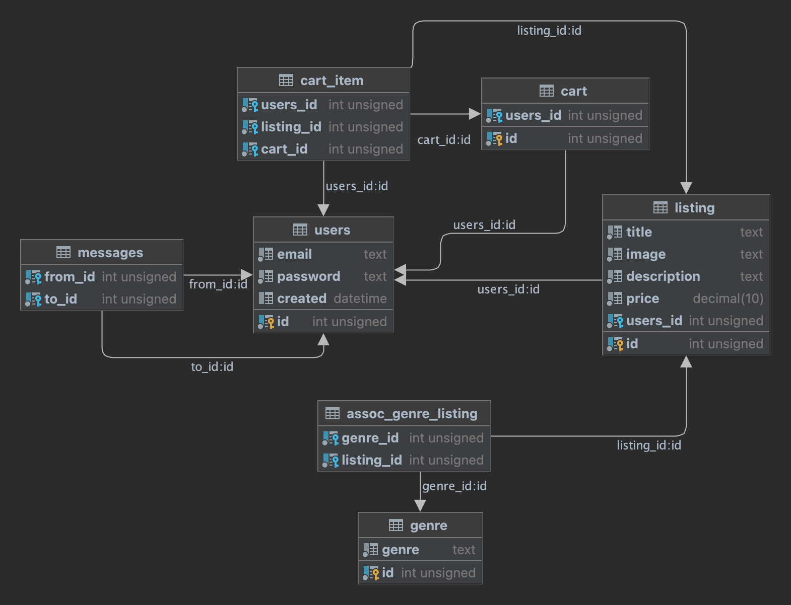
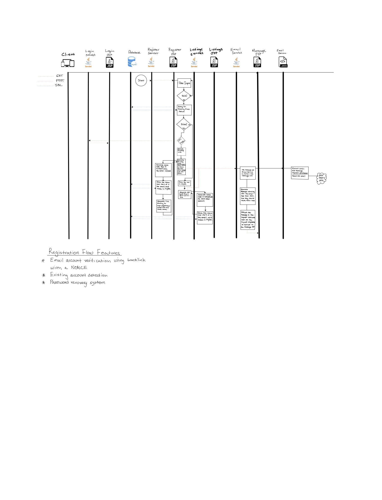
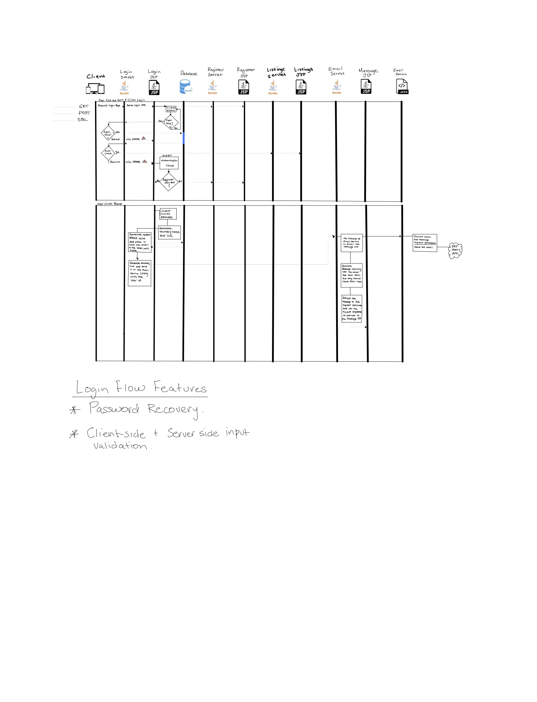

# Manga Adlister
Manga adlister is allows users to post listings of Mangas for sale.
Users can browse different categories of Manga and select as many as
they'd like and store them in their server side cart for purchase.

## Contribuitors
- John Krsak        - Developer
- Alvin Mckenzie    - Developer
- Aldanis Vigo      - Developer

## Database Schema

## Registration & Account Recovery Flow

<a href="docs/img/register_flow.pdf">Download PDF</a>

## Login & Account Recovery Flow

<a href="docs/img/login_flow.pdf">Download PDF</a>

## Post Listing Flow

When the user gets to the Manga Listings page, there will be user input options available to them on the page.
One of these options will be to post their own listings. Since the listings page will be available to the public
the first thing we do is check if the user has already been authenticated. If so, we redirect them to the page where
they can fill out the details of their listing. If not, we redirect them to the login page where they can either
fill in their auth details 

## Filter Listings Flow

## Send Messages Flow

## Read Messages Flow

## Add Product To Cart Flow

## Purchase Flow

